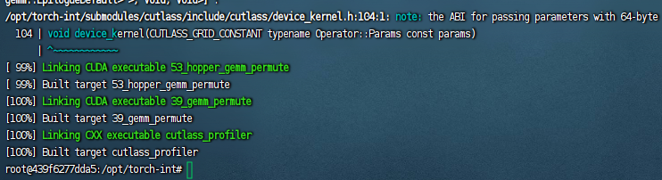
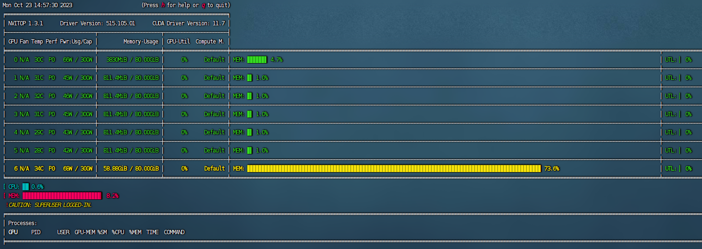

# Smoothquant
When referring to the github repo of smoothquant I discovered peers discussing auto GPTQ. That seems an approach devised earlier and also encapsulated, so I'll also conduction investigation and maybe experiment on it.

Smoothquant relies on torch-int, both are repos created and maintained by mit-han-lab. Note that there are two jupyter notebook files to reproduce the experiment results, but one is already unusable, because of problems of git lfs. For more details see issue #33 and issue #58, of which the latter was created by me.

The configuration and compilation of torch-int seem to be what's really challenging for me student with developing knowledge and capabilities.

# Installation of torch-int
### Questions of using git clone
Following the instructions in the readme file, error just occured when executing:

    git clone --recurse-submodules https://github.com/Guangxuan-Xiao/torch-int.git

The error information is as follows:

    Submodule 'submodules/cutlass' (git@github.com:NVIDIA/cutlass.git) registered for path 'submodules/cutlass'
    Cloning into '/opt/conda/bin/torch-int/submodules/cutlass'...
    kex_exchange_identification: Connection closed by remote host
    fatal: Could not read from remote repository.

I felt strange that the Nv repo, which should be in well maintenance cannot be found. I created the issue #22 but later I found the answer to the question in issue #3.

The ssh repo address sometimes fails to function, use https instead.

    modify the address in .gitmodules as: https://github.com/NVIDIA/cutlass.git 

This is familiar to any github usr. I created a new repo and pulled the content of torch-int repo, having the address fixed, and pushed it to Github. Then I was pulling this repo in the docker environment of the company, but somethings were missed.

    make: *** No targets specified and no makefile found.  Stop.

The cloning of cutlass repo wasn't successful yet. I quickly found it was the folder didn't exist. I suspected it's because git ignores empty folders, and results given by search engine confirmed this.
I tried ways of creating a .gitignore or .gitkeep file, however they resulted in a non-empty folder thus obstructing the cloning.

Why don't I just download zip, uncompress and upload? This seems foolish, but it worked. 

### Version conflict of tools

The next problem is a version conflict.

    CMake Error at CMakeLists.txt:29 (cmake_minimum_required):
    CMake 3.19 or higher is required.  You are running version 3.16.3

I used pip to install cmake of a higher version, and it was within expectaion that the system still used the original. Following tutorials of CSDN, somewhat like Chinese version of stackoverflow:

Deleted cmake of the old version:

    sudo rm -rf /usr/bin/cmake

The docker env didn't even have sudo. Run:

    apt-get install sudo

Then, searched for our new cmake executable file:

    which cmake

There was no response. But thanks for pip, which told me where the package was:

    Requirement already satisfied: cmake==3.20.2 in /opt/conda/lib/python3.8/site-packages (3.20.2)

So I built the soft link by:

    sudo ln -s /opt/conda/lib/python3.8/site-packages/cmake/data/bin/cmake /usr/bin/cmake

And it worked. 

### Python executable file configuration of cmake

New problem stroke in the configuration process by cmake:

    -- CMake Version: 3.20.2
    -- The CXX compiler identification is GNU 9.3.0
    -- Detecting CXX compiler ABI info
    -- Detecting CXX compiler ABI info - done
    -- Check for working CXX compiler: /usr/bin/g++ - skipped
    -- Detecting CXX compile features
    -- Detecting CXX compile features - done
    -- The CUDA compiler identification is NVIDIA 11.6.55
    -- Detecting CUDA compiler ABI info
    -- Detecting CUDA compiler ABI info - done
    -- Check for working CUDA compiler: /usr/local/cuda/bin/nvcc - skipped
    -- Detecting CUDA compile features
    -- Detecting CUDA compile features - done
    -- CUDART: /usr/local/cuda/lib64/libcudart.so
    -- CUDA Driver: /usr/local/cuda/lib64/stubs/libcuda.so
    -- NVRTC: /usr/local/cuda/lib64/libnvrtc.so
    -- Default Install Location: install
    -- Found Python3: /usr/bin/python3.8 (found suitable version "3.8.10", minimum required is "3.5") found components: Interpreter 
    CMake Error at CMakeLists.txt:100 (message):
    Error installing cutlass_library package.  See
    /opt/torch-int/submodules/cutlass/build/cutlass_library_installation.log

    -- Configuring incomplete, errors occurred!
    See also "/opt/torch-int/submodules/cutlass/build/CMakeFiles/CMakeOutput.log".
    make: *** No targets specified and no makefile found.  Stop.

And what the file contained seemed really easy to solve:

        Traceback (most recent call last):
    File "/opt/torch-int/submodules/cutlass/python/setup_library.py", line 33, in <module>
        from setuptools import setup
    ModuleNotFoundError: No module named 'setuptools'

But I had this package in my environment. So let's look into the CMakeList.txt file to find out what's wrong:

    # Install cutlass_library Python package
    execute_process(
    WORKING_DIRECTORY ${CUTLASS_DIR}/python
    COMMAND ${Python3_EXECUTABLE} ${CUTLASS_DIR}/python/setup_library.py develop --user
    RESULT_VARIABLE cutlass_lib_GENERATOR_INSTALL_RESULT
    OUTPUT_FILE ${CMAKE_CURRENT_BINARY_DIR}/cutlass_library_installation.log
    ERROR_FILE ${CMAKE_CURRENT_BINARY_DIR}/cutlass_library_installation.log
    )

    if(NOT cutlass_lib_GENERATOR_INSTALL_RESULT EQUAL 0)
    message(FATAL_ERROR "Error installing cutlass_library package. See ${CMAKE_CURRENT_BINARY_DIR}/cutlass_library_installation.log")
    endif()

It's using Python3_EXECUTABLE as the python executable file, and that is /usr/bin/python3.8. However I have always been using python or python3, that may be what the problem lies in.

Lets do some experiments:

    root@439f6277dda5:/opt/torch-int# /opt/conda/bin/python3.8
    Python 3.8.12 | packaged by conda-forge | (default, Oct 12 2021, 21:59:51) 
    [GCC 9.4.0] on linux
    Type "help", "copyright", "credits" or "license" for more information.
    >>> import setuptools
    >>> import ssss
    Traceback (most recent call last):
    File "<stdin>", line 1, in <module>
    ModuleNotFoundError: No module named 'ssss'

Well, it's not the problem, but the default python executable path is set usr/bin/python3.8. Let me figure out how to modify. 

Add this to the file build_cutlass.sh:

    export Python3_EXECUTABLE=/opt/conda/bin/python3.8

This didn't work. Try another way, set the python executable in the shell file:

    cmake .. -DCUTLASS_NVCC_ARCHS=80 -DCUTLASS_ENABLE_TESTS=OFF -DCUTLASS_UNITY_BUILD_ENABLED=ON -DPYTHON_EXECUTABLE=/opt/conda/bin/python3.8

But this also failed. Let's give a more careful look at the file and the error message, this process is the compilation by cmake, and the prominent config file is CMakeList.txt. Following the shell script, the path is ./submodules/cutlass/CMakeList.txt. Here we found where the error occurred:

    find_package(Python3 3.5 COMPONENTS Interpreter REQUIRED)

    # Install cutlass_library Python package
    execute_process(
    WORKING_DIRECTORY ${CUTLASS_DIR}/python
    COMMAND ${Python3_EXECUTABLE} ${CUTLASS_DIR}/python/setup_library.py develop --user
    RESULT_VARIABLE cutlass_lib_GENERATOR_INSTALL_RESULT
    OUTPUT_FILE ${CMAKE_CURRENT_BINARY_DIR}/cutlass_library_installation.log
    ERROR_FILE ${CMAKE_CURRENT_BINARY_DIR}/cutlass_library_installation.log
    )

    if(NOT cutlass_lib_GENERATOR_INSTALL_RESULT EQUAL 0)
    message(FATAL_ERROR "Error installing cutlass_library package. See ${CMAKE_CURRENT_BINARY_DIR}/cutlass_library_installation.log")
    endif()

From CSDN, I learned a little about find_package function:

    Usage:
    find_package(<PackageName> [version] [EXACT] [QUIET] [MODULE]
                [REQUIRED] [[COMPONENTS] [components...]]
                [OPTIONAL_COMPONENTS components...]
                [NO_POLICY_SCOPE])

    REQUIRED：denote that this package is essential, if cannot find the construction process reports error and terminates.
    [COMPONENTS] [components…]：Necessary components in all the packages being searched for, if any one can't be found it failes, similar to REQUIRED, will result in termination of cmake.
    OPTIONAL_COMPONENTS components…：will not affect cmake to continue executing if cannot find；
    NO_POLICY_SCOPE：cmake policy，refer to：cmake_policy
    Note that among all these parameters, only PackageName is necessary, the others are all optional.

It's here where the environment variable got changed. So insert such a violent sentence after:
   
    set(Python3_EXECUTABLE /opt/conda/bin/python3.8)

And this small question is finally solved. 

  

### C++ headfile link problem, setuptools usage and include path configuration

Then, run

    python setup.py install

And within expectation, it won't go smoothly:

    building 'torch_int._CUDA' extension
    /usr/local/cuda/bin/nvcc -Itorch_int/kernels/include -I/opt/conda/lib/python3.8/site-packages/torch/include -I/opt/conda/lib/python3.8/site-packages/torch/include/torch/csrc/api/include -I/opt/conda/lib/python3.8/site-packages/torch/include/TH -I/opt/conda/lib/python3.8/site-packages/torch/include/THC -I/usr/local/cuda/include -I/opt/conda/include/python3.8 -c torch_int/kernels/linear.cu -o build/temp.linux-x86_64-3.8/torch_int/kernels/linear.o -D__CUDA_NO_HALF_OPERATORS__ -D__CUDA_NO_HALF_CONVERSIONS__ -D__CUDA_NO_BFLOAT16_CONVERSIONS__ -D__CUDA_NO_HALF2_OPERATORS__ --expt-relaxed-constexpr --compiler-options '-fPIC' -O3 -std=c++14 -U__CUDA_NO_HALF_OPERATORS__ -U__CUDA_NO_HALF_CONVERSIONS__ -U__CUDA_NO_HALF2_OPERATORS__ -DCUDA_ARCH=800 -DTORCH_API_INCLUDE_EXTENSION_H -DPYBIND11_COMPILER_TYPE="_gcc" -DPYBIND11_STDLIB="_libstdcpp" -DPYBIND11_BUILD_ABI="_cxxabi1011" -DTORCH_EXTENSION_NAME=_CUDA -D_GLIBCXX_USE_CXX11_ABI=0 -gencode=arch=compute_80,code=compute_80 -gencode=arch=compute_80,code=sm_80
    torch_int/kernels/linear.cu:4:10: fatal error: cutlass/core_io.h: No such file or directory
        4 | #include <cutlass/core_io.h>
          |          ^~~~~~~~~~~~~~~~~~~
    compilation terminated.
    error: command '/usr/local/cuda/bin/nvcc' failed with exit status 1

This seems to be a problem in inclusion of C++ head file. Parts of the core_io.h file is as follows: 

    #include "include/linear.h"
    #include "include/common.h"

    #include <cutlass/core_io.h>
    #include <cutlass/cutlass.h>
    #include <cutlass/half.h>

    #include <cutlass/gemm/device/gemm.h>
    #include <cutlass/numeric_types.h>
    #include <cutlass/util/host_tensor.h>

There should be somewhere to configure the paths of headfiles. In my knowledge the <> characters are for system or standard head files, and "" are for these added by users. The compiler will search in current path, and then in the standard head file path.

However, in IDEs like VS, we can config the additional include directories. Let's look into the setup.py file to see if there are parameters for this purpose.

    setup(
        name='torch_int',
        ext_modules=[
            cpp_extension.CUDAExtension(
                name='torch_int._CUDA',
                sources=[
                    'torch_int/kernels/linear.cu',
                    'torch_int/kernels/bmm.cu',
                    'torch_int/kernels/fused.cu',
                    'torch_int/kernels/bindings.cpp',
                ],
                include_dirs=['torch_int/kernels/include'],
    ...

This corresponds to the error message above. So I add to include_dirs a path 'submodules/cutlass/include/cutlass', where core_id.h and several other headfiles lie in. 

    building 'torch_int._CUDA' extension
    /usr/local/cuda/bin/nvcc -Itorch_int/kernels/include -I/submodules/cutlass/include/cutlass -I/opt/conda/lib/python3.8/site-packages/torch/include 
    ...
    torch_int/kernels/linear.cu:4:10: fatal error: cutlass/core_io.h: No such file or directory
        4 | #include "cutlass/core_io.h"
        |            ^~~~~~~~~~~~~~~~~~~

Obviously, the path has been read successfully, but still it doesn't work. Why does #include "include/linear.h" work but this doesn't? I can find no reason for this.

Well, later I find myself stupid. When the compiler executes #include "include/linear.h" and #include "include/common.h" ,the headfiles are just found in the relative path of current folder, but I've been thinking they are found under torch_int/kernels/include. I forgot the principle that the whole path is that the include path/current path concatenates the relative path, and this elementary question has taken me several hours.

After addressing this one, the next is:

    torch_int/kernels/linear.cu:10:10: fatal error: cutlass/util/host_tensor.h: No such file or directory
    10 | #include <cutlass/util/host_tensor.h>
        |          ^~~~~~~~~~~~~~~~~~~~~~~~~~~~
    compilation terminated.

I tried to find the headfile manually, but with no result. Luckily I remember Linux provides easy-to-use commands to do such tasks. If cannot find, it means the construction actually failed, and that's real disaster.

Execute:

    find -name host_tensor.h
    ./submodules/cutlass/tools/util/include/cutlass/util/host_tensor.h

After adding this to path, the include problem is solved. 

### Error caused by low C++ version

And the following:

    /opt/torch-int/submodules/cutlass/include/cute/util/type_traits.hpp(62): error: namespace "std" has no member "conjunction"

    ...

    /opt/torch-int/submodules/cutlass/include/cute/util/type_traits.hpp(201): error: void_t is not a template

    /opt/torch-int/submodules/cutlass/include/cute/numeric/integral_constant.hpp(41): error: "auto" is not allowed here

    ...

    /opt/torch-int/submodules/cutlass/include/cute/numeric/integral_constant.hpp(98): error: the template argument list of the partial specialization includes a nontype argument whose type depends on a template parameter

    /opt/torch-int/submodules/cutlass/include/cute/numeric/integral_constant.hpp(99): error: "auto" is not allowed here

    /opt/torch-int/submodules/cutlass/include/cute/numeric/integral_constant.hpp(99): warning #842-D: constant "n" is not used in or cannot be deduced from the template argument list of class template "cute::is_constant<<error>, const T &>"

    ...

    /opt/torch-int/submodules/cutlass/include/cute/numeric/integral_constant.hpp(338): error: no instance of function template "cute::abs" matches the argument list
                argument types are: (<error-type>)

    ...

    /opt/torch-int/submodules/cutlass/include/cute/numeric/integral_constant.hpp(342): error: no instance of function template "cute::max" matches the argument list
                argument types are: (<error-type>, <error-type>)

    ...

    Error limit reached.
    100 errors detected in the compilation of "torch_int/kernels/linear.cu".
    Compilation terminated.

It's supposed that these are because the C++ version is too low. Let me try out how to configure.

Modify the parameter 'cxx' in extra_compile_args from ['-std=c++14', '-O3'] to ['-std=c++17', '-O3'] and all the errors above is solved. The warning that integer conversion resulted in a change of sign remains. 

### Changes of lib position and name

And the next question:

    g++ -pthread -shared -B /opt/conda/compiler_compat -L/opt/conda/lib -Wl,-rpath=/opt/conda/lib -Wl,--no-as-needed -Wl,--sysroot=/ build/temp.linux-x86_64-3.8/torch_int/kernels/linear.o build/temp.linux-x86_64-3.8/torch_int/kernels/bmm.o build/temp.linux-x86_64-3.8/torch_int/kernels/fused.o build/temp.linux-x86_64-3.8/torch_int/kernels/bindings.o -L/opt/conda/lib/python3.8/site-packages/torch/lib -L/usr/local/cuda/lib64 -lc10 -ltorch -ltorch_cpu -ltorch_python -lcudart -lc10_cuda -ltorch_cuda_cu -ltorch_cuda_cpp -o build/lib.linux-x86_64-3.8/torch_int/_CUDA.cpython-38-x86_64-linux-gnu.so -lcublas_static -lcublasLt_static -lculibos -lcudart -lcudart_static -lrt -lpthread -ldl -L/usr/lib/x86_64-linux-gnu/
    /opt/conda/compiler_compat/ld: cannot find -lcublas_static
    /opt/conda/compiler_compat/ld: cannot find -lcublasLt_static
    collect2: error: ld returned 1 exit status
    error: command 'g++' failed with exit status 1

This seems to be due to inconsistent positions. Issue #14 of the torch-int repo described this problem over 4 months ago but hasn't fixed yet...

The ld file in the compiler_compat folder is a linker executable file. It is used by the compiler to link object files and libraries together to create an executable or shared library, and is a compatibility linker that can be used with older versions of GCC that do not support newer linker options.

Use 

    find / -name "cublasLt" -print

but there's nearly no result.
The command searches for files and directories named “cublasLt” in the entire file system, starting from the root directory /. The -name option specifies the name of the file or directory to search for, and -print option prints the path of each file or directory that matches.
So use 

    find / -name "*cublas*" -print

There are a lot of results, and the possibly correlated ones are:
  
    /opt/conda/lib/python3.8/site-packages/torch/lib/libcublas.so.11
    /opt/conda/lib/python3.8/site-packages/torch/lib/libcublasLt.so.11
    /usr/local/cuda-11.6/targets/x86_64-linux/lib/libcublas.so
    /usr/local/cuda-11.6/targets/x86_64-linux/lib/libcublas.so.11
    /usr/local/cuda-11.6/targets/x86_64-linux/lib/libcublas.so.11.8.1.74
    /usr/local/cuda-11.6/targets/x86_64-linux/lib/libcublasLt.so
    /usr/local/cuda-11.6/targets/x86_64-linux/lib/libcublasLt.so.11
    /usr/local/cuda-11.6/targets/x86_64-linux/lib/libcublasLt.so.11.8.1.74
    /usr/local/cuda-11.6/targets/x86_64-linux/lib/stubs/libcublas.so
    /usr/local/cuda-11.6/targets/x86_64-linux/lib/stubs/libcublasLt.so

In Linux, .so files are shared library files, also known as shared object files. A shared library is a set of reusable code and data that can be shared by multiple programs, reducing memory usage and disk space.

The .so file extension indicates that it is a shared library file. In Linux, the naming convention for shared library files is lib<name>.so.<version>. 

Bing AI tells that the stubs folder contains stub libraries for CUDA. Stub libraries are used to provide a minimal implementation of a library’s interface, which can be used for linking and testing purposes without requiring the full implementation of the library.
In the context of CUDA, stub libraries are used to provide a minimal implementation of the CUDA driver API, which can be used to compile and link CUDA applications on systems that do not have a GPU or the full CUDA toolkit installed. So these two don't worth a try. 

At first I thought of editing the ld file, but failed to work out how to open it. I just modify the lib name from cublas_static to cublas, and in this way the compilation can finish.

    Installed /opt/conda/lib/python3.8/site-packages/torch_int-0.0.0-py3.8-linux-x86_64.egg
    Processing dependencies for torch-int==0.0.0
    Finished processing dependencies for torch-int==0.0.0

### Finally, it works out

Execute python tests/test_linear_modules.py:

    test_w8a8b8o8_linear_relu
    ic| r2: tensor(0.0002)
    test_w8a8b8o8_linear
    ic| r2: tensor(0.0002)
    test_w8a8b32o32_linear_with_scaling
    ic| r2: tensor(0.0002)
    test_w8a8bfp32ofp32_linear
    ic| r2: tensor(0.0001)

Torch-int has been successfully installed. It's been a long way. 
## Begin experiments on smoothquant, OPT 6.7B
Nvitop is so comfortable.

  

Modify the jupyter notebook file \examples\smoothquant_opt_real_int8_demo.ipynb to a python script, which directly loads the quantized model and does evaluation both on accuarcy and latency. And the hardware only allows me to try a model equals or smaller than opt-6.7B.
It will take some time to download the models. 

### Tensors not on the same device

A strange error occur in the case that I've set CUDA_VISIBLE_DEVICES 5. 

    RuntimeError: Expected all tensors to be on the same device, but found at least two devices, cuda:0 and cuda:1!

I didn't get useful measures on the Internet, but asked my mentor about this question. He told me to add CUDA_VISIBLE_DEVICES=5 before the command, this has higher priority and will be obeyed in the whole execution process. There isn't any parameter about devices in code of smoothquant, this may count for a flaw. Users may have to use this approach, or configure the CUDA_VISIBLE_DEVICES variable in any possible file.

## Result

    Model size: 12700.031MB
    FP16 accuracy: 0.799, per-sample lantecy: 51.663ms
    Model size: 6556.657MB
    SmoothQuant INT8 accuracy: 0.803, per-sample lantecy: 47.779ms

FP16 GPU memory occupation:

  

Int8 smoothquant GPU memory occupation:

  

There's only a decrease of 7.5% on inference time, this is more or less disappointing. And GPU memory comsumption is cut down by about 41%, and some inherent take-ups should be considered.

## Begin experiments on smoothquant, OPT 30B

    Model size: 57171.898MB
    FP16 accuracy: 0.807, per-sample lantecy: 226.516ms
    Model size: 28949.540MB
    SmoothQuant INT8 accuracy: 0.8, per-sample lantecy: 155.731ms

FP16 GPU memory occupation:

  

Int8 smoothquant GPU memory occupation:

  

# FINAL RESULT
