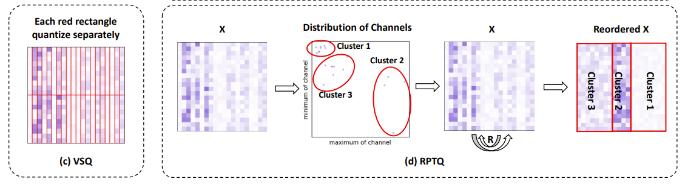

# Comprehension of recently devised approaches
I've just read some relatively new papers on this topic recently:
* Smoothquant; might be the most practical one, as it focuses on quantizing to int8 format, which has been supported by mainstream nv products. And it has also been encapsulated as a pypi package.

  Transfer quantizaiton difficulty from activations to weights, as the multitude and number of outliers in activations greatly exceed those in weights. Use a small benchmark dataset to get channel-wise activation scales and apply scaling to weights and activations accordingly, do not insert pseudo-quantization nodes between layers in inference. An inspiring idea, but it's doubtful that for different inputs, will the outliers cluster in same channels?

  

* Olive; might be of great potential, and the experiment results about accuracies have been reproduced. But it seems to need hardware support to outperform others, E2M1 and E4M3 operations do not seem to be supported by current GPUs.

  Introduces outlier-victim pairs to tackle the problem of quantizing outliers. Sacrifice the value beside an outlier (in the matrix) to let the outlier have a wider range to represent its value; the victim, who gets sacrificed, is substituted as an identifier. The paper also introduces Abfloat data format innovatively, and proves that E2M1(exponent2, mantissa 1 and sign 1) excels in 4 bit representations and E4M3 excels in 8 bit representations.

  

* RPTQ;
  Reorder-based PTQ, cluster the channels in the activations and reorganize them for quantization.
  According to the researchers: Firstly, RPTQ is more adept at addressing the challenge of channel difference in activations. By
clustering channels with similar value ranges, it diminishes the influence of both outliers and range
differences. Secondly, RPTQ exhibits memory and computation efficiency, as it only requires
managing quantization parameters for each cluster rather than each individual channel or vector.

  The paper gives a brief introduction to smoothquant to compare with and demonstrate the advantages of RPTQ but I'm suspicious about that. The savings on memory and computation load, theroretically, is not prominent. But clustering channels by K-means rendering scales from channel-wise to cluster-wise intuitively decreases accuracy of representing, expanding quantization errors, often calculated as MSE.

  And what's important is that this hasn't been encapsulated, thus not convenient to use(
    

  

* MoFQ;
  Mixture of Formats Quantization, which selects the optimal format on a layer-wise basis.
FP8 has already garnered support from leading hardware vendors, mainly refers to H100 and H800, which offers identical peak performance for FP8 and INT8 operations.
  The paper claims that while FP MAC(multiply-accumlation) generally requires more hardware resources than INT MAC, the resource gap substantially narrows as the bit width decreases,
with FP8 and INT8 costs being notably similar.

  The optimal format is influenced by a combination of various factors,
including the static/dynamic nature of tensors, outlier distribution, and quantization bit-width. For
weight tensors with static distribution, INT quantization outperforms FP quantization at 8-bit but
this advantage diminishes at 4-bit. For activation tensors with dynamic distribution and significant
outliers, FP quantization surpasses INT quantization due to FP can represent large values with lower
precision and small values with higher precision.

  Inspired by the analysis finding of no consistent superior format, the authors propose the approach which selectively determines the optimal format from INT and
FP with the same bit-width on a layer-wise basis. The selection method choosing the format with the minimum quantization error based on metrics such as tensor
MSE, layer output MSE, or model output MSE, proves
effective according to the paper, and also is applied by other researchers. There hasn't been any proof that the smaller quantization MSE is the higher accuracy we get, but it's intuitive.

   Paper draws the conclusion that INT8 is better for weights and FP8 is better
for activation, the accuracy of output activation depends on the impact of weight and input activation being multiplied, so there
is also no consistent superior format for W8A8 quantization. The key idea is to leverage the complementary advantages of both formats in a unified framework, thereby maximizing the potential benefits.

  However, DesignOrder does not possess H100 or more advanced GPUs so far, and I'm also skeptical that MAC between FP and INT retain the efficiency of INT's. 
   

  

   

  

* Zeroquant-FP;
   This paper claims that FP8 activation consistently outshines its integer (INT8) equivalent, and for weight quantization, FP4 exhibits comparable, if not superior, performance to INT4, simplifying deployment
  on FP-supported hardware like H100.

  First it invokes studies that indicate PTQ on 8-bit integer (INT8) weight-only quantization does not compromise the quality of LLMs, and only a
minor accuracy drop is observed with INT4 weight quantization when advanced algorithm such as GPTQ
applied. In studies such as ZeroQuants, SmoothQuant and others, reducing the precision of activation from FP16 to INT8 inevitably results in a decrease in model
quality. Despite the potentially higher computation cost of FP8 compared to INT8 and in light of hardware
support, the improved model quality could make this trade-off worthwhile and merits further exploration. In larger
models, FP8 activation and weight quantization result in negligible degradation. Given the limitations of integer quantization, floating-point methods such as FP8 or FP4, utilizing ExMy
notation, emerge as superior alternatives.

  The actual software implementation of W4A8 in H100 NVIDIA hardware is
that one needs to cast W’s FP4 to match the FP8 precision used in A. The direct method of dequantization
followed by quantization again could potentially have a detrimental effect on inference efficiency, hence the paper constrains S(scaling factor) to be a power of 2 to alleviate.

  At last, it's concluded that FP8 Activation is much better than INT8, FP8 weights rival INT8, while FP4 weights potentially outperform INT4.
  
  However, these are not taken into our account because of lack of hardware support.

* Outlier Supression+;
  Introduces optimal channel-wise shifting and scaling operations, out of the fact that distribution of values or outliers is not only varying between channels, but also asymmetric in every channel. This correspond to mathematic intuitive greatly, and is believed to achieve satisfactory performance in real practice.
  The experiments include comparisons with smoothquant, and outperforms it. What's confusing is that some of the experiments carried out on INT6 format, which hasn't been supported by any hardware as far as I know.
  

  

They are on post-training quantization of both weights and activations, and mostly devised by Chinese scholars. I wonder if it's I read too few papers or it's just because this area is particularly concerned by Chinese researchers, maybe out of the restriction by US government on Chinese clients purchasing nv GPUs.

The papers or approaches listed above is also introduced in 'A Survey on Model Compression for Large Language Models' by Zhu et al.. 
# Investigations of current available hardware
DesignOrder's main computation hardware is nv A800. Investigate about it will bring benefits in the aspect of quantization, which tightly correlates with hardware.

  

  

## Composition and Aritecture
The A800 uses the Ampere architecture, where each SM unit is divided into 4 processing blocks, in which each processing block contains:

*1 Warp Scheduler, 1 Dispatch Unit
*8 FP64 Cores
*16 FP32 Cores
*16 INT32 Cores
*1 Tensor Core
*8 LD/ST Units
*4 SFUs

The NVIDIA A800 uses the NVIDIA TensorRT inference optimization engine, which can accelerate various deep learning inference tasks.
Tensor Core is a major innovation that started with the Volta architecture. The fundamental reason is that the GPU is still too versatile to do AI, the most common Conv/Gemm operation still has to be encoded into a bunch of FMA, and the hardware level still needs to rotate the data according to register-ALU-register-ALU-register, and the effect-energy consumption ratio is completely incomparable to ASIC.

Google released TPU, an internal systolic array, which achieves a very high energy consumption ratio by allowing data to flow between ALUs and eliminating repetitive access.

NVIDIA doesn't seem to have directly disclosed implementation details for Tensor Cores, but it's generally believed that this is a small systolic array

Functions of the individual units in a typical SM:

CUDA Core: Responsible for performing single-precision operations such as FMUL, FADD, and FFMA. To improve the throughput of instructions, CUDA Core is the pipelined.
DP Unit: Responsible for performing duoble precision operations.
LD/ST: Responsible for memory load, store and other operations.
SFU: The Special Function Unit is responsible for calculating special functions, such as __cosf(), __expf() in CUDA, and the intrinsics calls the SFU unit. It should be noted that SFU implements fast approximation operation, which may affect accuracy.
register file: A register group used to store data
dispatch unit: responsible for assigning different types of instructions to different units for execution
Warp Scheduler: Responsible for managing a series of Warps and selecting eligible Warp launch instructions
The hash power of the entire GPU chip is equal to the hash power of a single SM multiplied by the number of SMs.

## How are Theoretical Computaional Capabilities Calculated
Taking the Tesla P100 as an example, the GPU frequency is 1.48GHz, the number of single-precision CUDA Cores is 64, and each CUDA core can execute one FFMA instruction and do two floating-point calculations in a single clock cycle. So the hash power of a single SM and the entire GPU is calculated as follows:

Single SM FP32 hashrate = 1.48 GHz * 64 CUDA Cores * 2 Operations/cycle = 189.44 GFLOPs

P100 FP32 hashrate = 189.44 GFLOPs * 56 SMs = 10.6 TFLOPs

P100 FP16 hashrate = 10.6 * 2 = 21 TFLOPs

Volta's tensor core A cycle can calculate the multiplication and addition operation of two 4x4 matrices, or 64 FMAs. There are 8 tensor cores in an SM of a volta, and the peak computing power is 8x64=512 FMA. While a pascal SM species has 64 cuda cores, a cycle can calculate 64 FMAs. The entire Tesla V100 GPU has 80 SMs, the main frequency is 1.53GHz, and its computing power is calculated as follows:

Single SM FP16 hashrate = 1.53 GHz * 8 Tensor Cores * 128 Operations/cycle = 1556.72 GFLOPs

V100 FP16 hashrate = 1556.72 GFLOPs * 80 SMs = 124.5 TFLOPs

The introduction of tensor cores has greatly increased the computing power of GPUs, but the progress of memory bandwidth has been relatively slow. This also makes more and more workloads, more and more inclined towards memory bound. Therefore, in modern GPU development, how to optimize memory access is becoming more and more important.

A100 SM introduces the new third-generation Tensor Cores, which can perform 256 FP16/FP32 FMA calculations per clock cycle per Tensor Core.

The A100 has 4 Tensor Cores per SM, and each SM provides 1024 dense FP16/FP32 FMA operations, doubling the hashrate per SM compared to Volta and Turing.

Third-generation Tensor Core features:
The supported data types are FP16, BF16, TF32, FP64, INT8, INT4, and INT1, with double the performance and inversely proportional to the data bit width;
BF16/FP32 mixed precision and FP16/FP32 operate at the same rate;

TOPS only refers to the trillions of operations per second of the processor, which need to be combined with the accuracy of specific data types to be converted to FLOPS. The number of MACs (MAC/Multiply Accumulate) in 8-bit precision is halved at FP16 (half-floating-point/16-bit floating-point) accuracy. PS: NVIDIA, Intel, and Arm have teamed up to write the FP8 Formats for Deep Learning white paper. The industry has now dropped from 32 bits to 16 bits, and now even shifted to 8 bits (FP8 precision: 8-bit floating-point arithmetic specification), which is why NVIDIA uses FP8 to characterize computing power. NVIDIA's Thor 2000TOPS is also talking about this.

TOPS is the number of MAC operations in 1 second, and the calculation formula is:
TOPS = MAC matrix row * MAC matrix column * 2 * main frequency;

## Constraints in Real Situation
The advertised TOPS are often the theoretical values of the arithmetic units, rather than the real values of the entire hardware system. The true value depends more on the internal SRAM, external DRAM, instruction set, and model optimization. In the worst case, the real value is 1/10 of the theoretical value or even lower, which is generally 50% of the utilization rate.

The theoretical value depends on the precision of the operation, the number of MACs (MAC/Multiply Accumulate) and the frequency of operation. It can be roughly simplified to the fact that the number of MACs in INT8 accuracy is halved at FP16 accuracy. FP32 is cut in half again, and so on.
Assume that there are 512 MAC arithmetic units running at 1GHz, INT8 data structures and precision, and a hashrate of 512 x 2 x 1 GHz = 1000 Billion Operations/Second = 1 TOPS (Tera-Operations/second). FP16 accuracy is 0.5TOPS, FP32 accuracy is 0.25TOPS. NVIDIA's Tesla V100 has 640 Tensor cores, each core has 64 MAC arithmetic units, and runs at a frequency of about 1.480GHz, so the computing power under INT8 is 640 * 64 * 2 * 1.480 GHz = 121TOPS.

The most important factor determining the true value of computing power is memory (SRAM and DRAM) bandwidth, and the algorithm's demand for memory bandwidth is usually expressed by the amount of "operational intensity, or arithmetic intensity", in OPs/byte. This amount means how many operations can be supported per unit of data read in the algorithm on average. The greater the operation intensity, it means that the unit data can support more operations, which means that the algorithm has lower requirements for memory bandwidth.

Let's take an example. For a 3x3 convolution operation with a step size of 1, assume that the input data plane size is 64x64. For simplicity, assume that both the input and output features are 1. At this time, a total of 62x62 convolution operations are required, and each convolution needs to do 3x3=9 multiplication and addition operations, so the total number of calculations is 34596, and the amount of data is (assuming that both the data and the convolution kernel use single-precision floating-point numbers 2byte): 64x64x2 (input data) + 3x3x2 (convolution kernel data) = 8210 byte, so the operation intensity is 34596/8210=4.21. If we switch to 1x1 convolution, then the total number of computations becomes 64x64=4096, and the amount of data required is 64x64x2 + 1x1x2=8194. Obviously, switching to 1x1 convolution can reduce the amount of computation by nearly 9 times, but the computational intensity is also reduced to 0.5, that is, the demand for memory bandwidth also increases by nearly 9 times. Therefore, if the memory bandwidth cannot meet the 1x1 convolution calculation, then switching to 1x1 convolution computing reduces the computation amount by nearly 9 times, but it cannot increase the computing speed by 9 times.

# Conclusion on What the Company should Focus on
 If the memory bandwidth meets the need, when the company's existing hardware uses INT8 and INT4 quantization, it can simultaneously compress the memory occupation and improve the inference speed, and theoretically the inference speed of INT8 is twice that of 16-bit, and the inference speed of INT4 is 4 times that of 16-bit. For practical deployment of quantization techniques, DesignOrder should focus on INT8 and potentially INT4 approaches. So far there's 3 worthy of trying: smoothquant, Olive and OS+. 